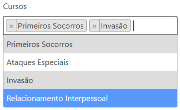

# Projeto Sistema Acadêmico de Heróis

Projeto piloto possibilita cadastro de: 
- Estudantes (indivíduo que recebe formação e instrução)
    - Estuda em muitos cursos.
- Professores (quem ensina ciência, arte, técnica ou outros conhecimentos)
    - Pode coordenar um departamento e leciona cursos.
- Departamentos (repartição, setor, divisão)
    - Possui cursos e um coordenador.
- Cursos (matéria a ser cursada).
    - Pertence a um departamento, possui alunos e professores.

## DataTable

O sistema possui um datatable que possibilita paginação, filtro por página e pesquisa.

## Exemplo de relacionamento 1xn:

Um departamento possui um coordenar e um professor pode coordenar muitos departamentos.

## Exemplo de relacionamento nxn:

Professor pode lecionar em muitos cursos e um curso pode ter muitos professores:

Aluno pode estar em muitos cursos e um curso pode ter muitos alunos.

A fim de aprendizado, diferenciando de professor que utiliza checkbox para associá-lo a muitos cursos, estudante utiliza select dinâmico para o mesmo objetivo.

## Projetos e pacotes de referência: 

- https://docs.microsoft.com/pt-br/aspnet/core/data/ef-mvc/?view=aspnetcore-3.1
- https://www.schoolofnet.com/projeto-pratico/aspnet/dotnet-core/sistema-de-supermercado-com-aspnet-core/
- https://select2.org/
- https://datatables.net/